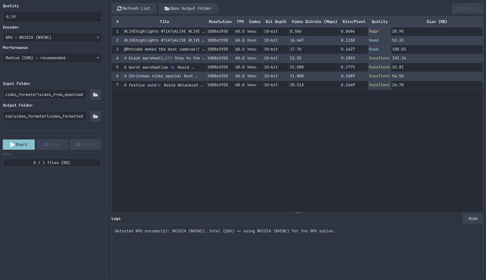

# PyVidoz



A batch video formatter/upscaler for downloaded social-media clips (TikTok,
etc), built to claw back some of the quality lost when platforms
re-compress videos before you download them.

## Why this exists

Videos downloaded from social platforms are almost always re-encoded by the
platform (and sometimes again by the download tool) into low-bitrate,
8-bit, sub-1080p files -- noticeably worse than the original phone
recording. The analyzer in this repo (`python -m models.video_analyzer`)
quantifies that gap directly:
comparing downloaded clips against native iPhone recordings typically shows
the iPhone files carrying several times more data per pixel at the same
resolution.

PyVidoz batch-normalizes a folder of those downloads into one consistent,
higher-quality delivery spec -- Full HD, 60fps, 10-bit HEVC, at a bitrate
tuned to a target quality density -- so a folder of clips downloaded at all
different resolutions/framerates/bitrates comes out consistent and ready to
re-edit, archive, or re-upload.

**Important limitation:** this cannot recover detail that the platform's
lossy compression already discarded. It reduces further degradation
(denoise), normalizes format/resolution/framerate, and re-encodes at a
higher bitrate -- it does not perform true AI super-resolution. Garbage in
still means soft video out; it just won't get worse and won't be
inconsistent across your library anymore.

## What it does

For every video in an input folder:

- **Resolution** normalized to Full HD vertical (1080x1920) -- lanczos-scaled
  to cover the frame, then center-cropped to trim any aspect-ratio overhang.
  A no-op for clips already at 1080x1920.
- **Frame rate** raised to 60fps via a cheap duplication-based conversion
  (not motion-compensated interpolation -- see [Performance notes](#performance-notes)
  for why).
- **Codec** re-encoded to HEVC (H.265), 10-bit, Main10 profile, `yuv420p10le`.
- **Denoise** (`hqdn3d`) to soften visible compression blockiness before
  upscaling.
- **Bitrate** targeted to a bits-per-pixel quality density (default `0.19`,
  tuned so the actual measured output lands in the "Excellent" density
  bucket used by the analyzer, compensating for NVENC's VBR undershoot).
- **Color space** stays SDR `bt709` -- it is not relabeled as HDR `bt2020`,
  since relabeling SDR pixel data as HDR without real HDR mastering info
  makes colors look wrong, not better.

## Requirements

- Python 3.10+
- `ffmpeg.exe` / `ffprobe.exe` -- **not included in this repo** (large binaries,
  ~124MB each). Download a Windows build from
  <https://www.gyan.dev/ffmpeg/builds/> (or <https://ffmpeg.org/download.html>
  for other platforms) and place `ffmpeg.exe` and `ffprobe.exe` directly next
  to the scripts in the project root.
- A GPU is optional but strongly recommended (NVENC/QSV/AMF hardware
  encoding is auto-detected) -- see [Performance notes](#performance-notes).

## Installation

```bash
git clone https://github.com/limkhysok/PyVidoz.git
cd PyVidoz
```

Create and activate a virtual environment (recommended so dependencies stay
isolated from your system Python):

```bash
python -m venv .venv
# Windows:
.venv\Scripts\activate
# macOS/Linux:
source .venv/bin/activate
```

Install the project (dependencies are declared in `pyproject.toml`):

```bash
pip install -e .
```

Download `ffmpeg.exe`/`ffprobe.exe` (see [Requirements](#requirements) above)
and drop them into the project root, next to `main.py`.

Verify the setup without encoding anything:

```bash
python -m models.video_formatter --dry-run
```

If it prints ffmpeg commands instead of an error about missing
`ffmpeg.exe`/`ffprobe.exe`, you're ready to go.

## Usage

### GUI

```bash
python main.py
```

Pick an input folder of downloaded videos and an output folder, choose
CPU or GPU encoding and a performance level, hit Start. Re-encoding runs in
a background thread so the UI stays responsive; select a finished file in
the table and press "Detail" to see its full technical profile.

### CLI

```bash
python -m models.video_formatter                        # video_from_download -> video_formatted
python -m models.video_formatter --in FOLDER --out FOLDER
python -m models.video_formatter --bpp 0.19              # target quality density
python -m models.video_formatter --no-interpolate        # keep source fps instead of converting to 60
python -m models.video_formatter --encoder nvenc         # force an encoder (auto|cpu|nvenc|qsv|amf)
python -m models.video_formatter --cpu-limit 50          # cap CPU-side threads to ~50% of cores
python -m models.video_formatter --dry-run               # print ffmpeg commands only
```

Encoder backend can run on CPU (`libx265`, software) or GPU (NVENC/QSV/AMF
hardware encoders, auto-detected at startup by actually test-initializing
each one). `--cpu-limit` caps threads for the CPU-bound filter steps
(fps-conversion, denoise) always, and for the encode step too when
`--encoder cpu` is used -- there's no equivalent usage-% throttle for GPU
encoders in ffmpeg.

### Analyzer / comparator

```bash
python -m models.video_analyzer
python -m models.video_analyzer --json report.json
```

Probes every file in `video_from_iphone/` and `video_from_download/` with
`ffprobe` and prints a side-by-side technical comparison (resolution,
codec, bitrate, bits-per-pixel quality density, color depth, etc), plus a
same-resolution apples-to-apples comparison where possible. Useful both to
justify why re-encoding is worth doing, and to sanity-check the output
afterward.

## Performance notes

Measured on a 20.6s, 1080x1920 test clip, RTX 4060, before settling on the
current defaults:

| Approach | Time | Notes |
|---|---|---|
| `minterpolate` motion-compensated 60fps (`mi_mode=mci`) | ~263.5s | True motion-estimated in-between frames. Always runs on CPU regardless of encoder choice -- no GPU path exists for it in this ffmpeg build. |
| `fps=60` duplication-based conversion (current default) | ~6.3s | ~42x faster. No new motion detail, but hits the 60fps target property that matters for delivery specs. |
| No 60fps conversion at all | ~3.9s | Baseline; keeps source fps. |

**Takeaway:** motion-compensated interpolation is the single most expensive
step in this pipeline by a wide margin, and GPU vs CPU encoder choice barely
matters by comparison -- NVENC only speeds up the final encode step, not the
CPU-bound frame-rate/denoise filters. That's why the default trades true
motion smoothing for a duplication-based conversion: seconds per clip
instead of minutes, for a property (60fps) most viewers won't perceive a
difference on anyway.

If you want the smoother (but much slower) motion-compensated interpolation
back, swap the `fps={TARGET_FPS}` filter in `build_filters()`
(`models/video_formatter.py`) for `minterpolate=fps={TARGET_FPS}:mi_mode=mci:mc_mode=aobmc:vsbmc=1`.

## Project structure

The GUI follows MVVM. `main.py` is the entry point; business logic (Model),
Qt state/orchestration (ViewModel), and widgets (View) live in separate
packages:

```
main.py               GUI entry point -- python main.py to launch
models/                Model layer: pure domain logic, no Qt dependency
    config.py              shared paths/constants (ffmpeg paths, target bpp/fps/res, encoders)
    utils.py                shared ffprobe/parsing helpers
    video_analyzer.py       quality analyzer/comparator; also runnable as a CLI (python -m models.video_analyzer)
    video_formatter.py      batch re-encoding logic; also runnable as a CLI (python -m models.video_formatter)
viewmodels/            ViewModel layer: Qt QObjects, no widget code
    workers.py               background QThread workers (formatting/probing/encoder detection)
    main_view_model.py       MainViewModel -- owns workers + batch/probe state, exposes Qt signals
views/                 View layer: PySide6 widgets only
    theme.py                 stylesheet, palette, icon, display-config constants
    detail_dialog.py          per-file technical profile dialog
    main_window.py            main window; binds to MainViewModel, no business logic
pyproject.toml        Project metadata + dependencies (PySide6)
.gitignore            Excludes ffmpeg/ffprobe binaries, video I/O folders, build artifacts
```

## Folder layout

```
video_from_download/   input videos to process (gitignored, personal data)
video_formatted/        output of the GUI / python -m models.video_formatter (gitignored)
video_from_iphone/      reference clips for python -m models.video_analyzer to compare against (gitignored)
```

These folders are gitignored since they hold personal/large media files, not
source code.
